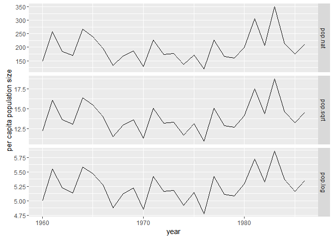
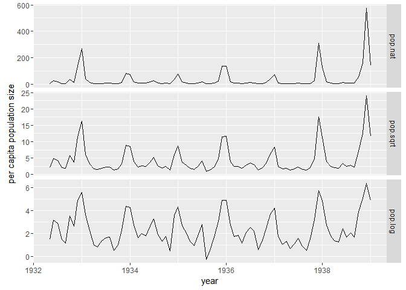
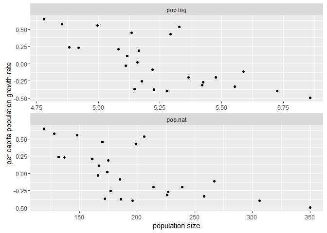
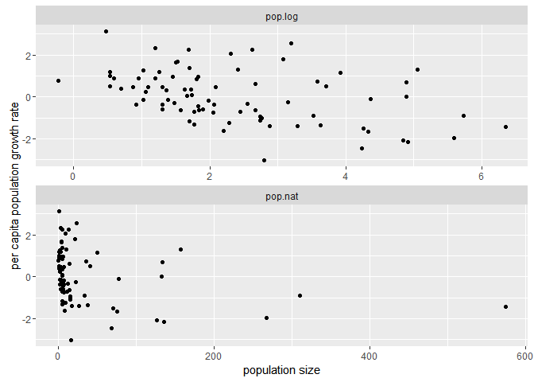
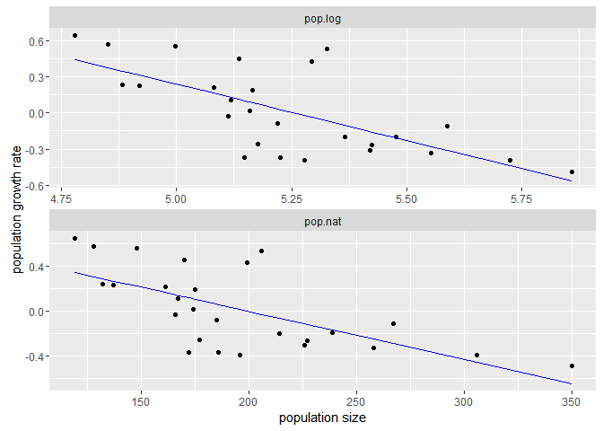
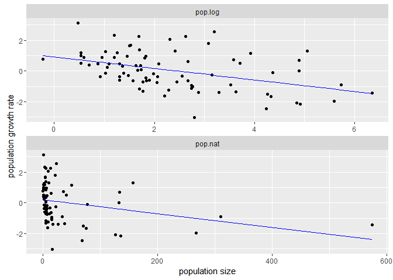
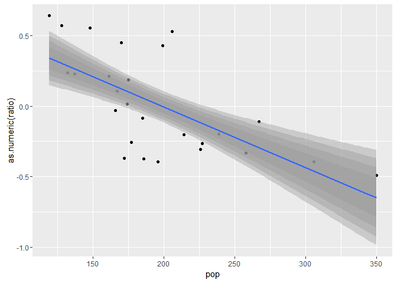

# hw6_lm_FHChang
Feng-Hsun Chang  
2016.Oct.17  

First I read in data from my own GitHub repository 


```r
library(RCurl)
library(plyr)
library(dplyr)
library(tidyr)
library(ggplot2)

dat1_raw=read.csv(text=getURL("https://raw.githubusercontent.com/OscarFHC/EEB480_ModelInfer_assignment/master/Mod_Infer_hw6/Parus_major_Wytham_Wood.csv"), sep=",", header=T,comment.char="#")
dat2_raw=read.csv(text=getURL("https://raw.githubusercontent.com/OscarFHC/EEB480_ModelInfer_assignment/master/Mod_Infer_hw6/Thrips_imaginis_Davidson1948.csv"), sep=",", header=T,comment.char="#")
parus = dat1_raw %>%
  rename(yr=Sample.Date, pop.nat=Population)
thrip = dat2_raw %>%
  mutate(yr=Sample.Date%/%1,
         month=round(100*(Sample.Date%%1)),
         time=yr+month/12,
         pop.nat=Population,
         Population=NULL,
         Sample.Date=NULL)
```


## Exercise 1

Here I plot the time series of each data set in untransformed population size (pop.nat), squared root-transformed population size (pop.sqrt) and log-transformed population size (pop.log). 


```r
parus.ex1 = parus %>%
  mutate(pop.sqrt=sqrt(pop.nat), pop.log=log(pop.nat)) %>%
  gather(key=variable, value=pop, -c(yr))
parus.ex1[,"variable"]=factor(parus.ex1[,"variable"], levels=c("pop.nat", "pop.sqrt", "pop.log"))

ggplot(data=parus.ex1, aes(x=yr, y=pop), group=gp)+
  geom_line()+
  facet_grid(variable ~ ., scales = "free_y")+
  xlab("year")+
  ylab("per capita population size")
```

<!-- -->

```r
thrip.ex1 = thrip %>%
  mutate(pop.sqrt=sqrt(pop.nat), pop.log=log(pop.nat)) %>%
  gather(key=variable, value=pop, -c(yr, month, time))
thrip.ex1[,"variable"]=factor(thrip.ex1[,"variable"], levels=c("pop.nat", "pop.sqrt", "pop.log"))

ggplot(data=thrip.ex1, aes(x=time, y=pop), group=variable)+
  geom_line()+
  facet_grid(variable ~ ., scales = "free_y")+
  xlab("year")+
  ylab("per capita population size")
```

<!-- -->

```r
  # Question: not sure how to organize the format of date? Like what should I do if I want to make the label of x=axis as 1934 Mar., etc
```

Here I found that, among the three transformations of the population size, the dynamics of parus population (the first figure) are more similar than those of thrip population. This is probably due to the fact the parus population size is more normally distributed (the parus population is almost normally distributed, p-value of Shapiro-Wilk normality test is 0.0536849), but the thrip population size distribution is highly right skewed. 

## Exercise 2

Here I plot the relationships between $log\frac{N~t~}{N~t-1~}$ and $log(N~t-1~)$ (left) as well as $log\frac{N~t~}{N~t-1~}$ and ${N~t-1~}$ (right) of parus and thrip population size. 


```r
parus.ex2 = parus  %>%
  mutate(pop.log=log(pop.nat)) %>%
  mutate(ratio=c(log(parus[,"pop.nat"][2:nrow(parus)]/parus[,"pop.nat"][1:(nrow(parus)-1)]), "NA")) %>%
  filter(ratio!="NA") %>%
  gather(key=variable, value=pop, -c(yr, ratio))
  
ggplot(data=parus.ex2, aes(x=pop, y=as.numeric(ratio)), group=variable)+
  geom_point()+
  facet_wrap(~variable, nrow=2, scales="free")+
  #facet_grid(variable~., scales = "free")+ #this is not working
  xlab("population size")+
  ylab("per capita population growth rate")
```

<!-- -->

The parus data set returns me similar patterns and both of them show a negative relationship, which possibly indicates a existence of density dependency. 


```r
thrip.ex2 = thrip  %>%
  mutate(pop.log=log(pop.nat)) %>%
  mutate(ratio=c(log(thrip[,"pop.nat"][2:nrow(thrip)]/thrip[,"pop.nat"][1:(nrow(thrip)-1)]), "NA")) %>%
  filter(ratio!="NA") %>%
  gather(key=variable, value=pop, -c(yr, month, time, ratio))

ggplot(data=thrip.ex2, aes(x=pop, y=as.numeric(ratio)), group=variable)+
  geom_point()+
  facet_wrap(~variable, nrow=2, scales="free")+
  #facet_grid(variable~., scales = "free")+ #this works
  #facet_grid(.~variable, scales = "free")+ #this is not working..
  xlab("population size")+
  ylab("per capita population growth rate")
```

<!-- -->

```r
  # Question: why "acet_grid(variable~., scales = "free")" does not give me free x and y scale?
```

The thrip data only shows a slightly negative trend when the population size is log-transformed. Although there is also a negative relationship between per capita growth rate versus population size, it could be dominated by those measurements of large population size. This implies it might not be proper to fit the Ricker model to the thrip data as the error of the population size of thrip is probably not normally distributed. 

## Exercise 3 and 4


```r
parus.ex3 = parus  %>%
  mutate(pop.log=log(pop.nat)) %>%
  mutate(ratio=c(log(parus[,"pop.nat"][2:nrow(parus)]/parus[,"pop.nat"][1:(nrow(parus)-1)]), "NA")) %>%
  filter(ratio!="NA")

parus.lm.ricker=lm(ratio~pop.nat, data=parus.ex3)
  summary(parus.lm.ricker)
```

```
## 
## Call:
## lm(formula = ratio ~ pop.nat, data = parus.ex3)
## 
## Residuals:
##     Min      1Q  Median      3Q     Max 
## -0.4831 -0.1445 -0.0328  0.1754  0.5611 
## 
## Coefficients:
##              Estimate Std. Error t value Pr(>|t|)    
## (Intercept)  0.851964   0.203216   4.192 0.000324 ***
## pop.nat     -0.004286   0.001002  -4.278 0.000260 ***
## ---
## Signif. codes:  0 '***' 0.001 '**' 0.01 '*' 0.05 '.' 0.1 ' ' 1
## 
## Residual standard error: 0.2744 on 24 degrees of freedom
## Multiple R-squared:  0.4326,	Adjusted R-squared:  0.409 
## F-statistic:  18.3 on 1 and 24 DF,  p-value: 0.0002605
```

```r
  AIC(parus.lm.ricker)
```

```
## [1] 10.45834
```

```r
parus.r.ricker=parus.lm.ricker$coefficients[1]
parus.K.ricker=-(parus.lm.ricker$coefficients[1]/parus.lm.ricker$coefficients[2])

parus.lm.gomp=lm(ratio~pop.log, data=parus.ex3)
  summary(parus.lm.gomp)
```

```
## 
## Call:
## lm(formula = ratio ~ pop.log, data = parus.ex3)
## 
## Residuals:
##      Min       1Q   Median       3Q      Max 
## -0.47007 -0.11711 -0.03817  0.17139  0.59720 
## 
## Coefficients:
##             Estimate Std. Error t value Pr(>|t|)    
## (Intercept)   4.9198     1.0526   4.674 9.52e-05 ***
## pop.log      -0.9360     0.2006  -4.666 9.70e-05 ***
## ---
## Signif. codes:  0 '***' 0.001 '**' 0.01 '*' 0.05 '.' 0.1 ' ' 1
## 
## Residual standard error: 0.2638 on 24 degrees of freedom
## Multiple R-squared:  0.4757,	Adjusted R-squared:  0.4539 
## F-statistic: 21.78 on 1 and 24 DF,  p-value: 9.697e-05
```

```r
  AIC(parus.lm.gomp)
```

```
## [1] 8.405904
```

```r
parus.r.gomp=-log(-parus.lm.gomp$coefficients[2])
parus.K.gomp=exp(parus.lm.gomp$coefficients[1]/-(parus.lm.gomp$coefficients[2]))
```

The carrying capacity of parus is estimated to be 198.7591214 by the Ricker model and 191.7407992 by the Gompertz model. The two estimates of carrying capacity are pretty similar. However, the two estimates of the intrinsic grwoth rate (0.8519642 by the Ricker model and 0.0661205 by the Gompertz model) in two model differ more than one order of magnitude. This is intriguing because the patters of the two relationships are so similar. From these results, I think the density dependency exists but the way to model density dependency largely affects the intrinsic growth rate and carrying capacity. 


```r
thrip.ex3 = thrip  %>%
  mutate(pop.log=log(pop.nat)) %>%
  mutate(ratio=c(log(thrip[,"pop.nat"][2:nrow(thrip)]/thrip[,"pop.nat"][1:(nrow(thrip)-1)]), "NA")) %>%
  filter(ratio!="NA")

thrip.lm.ricker=lm(ratio~pop.nat, data=thrip.ex3)
  summary(thrip.lm.ricker)
```

```
## 
## Call:
## lm(formula = ratio ~ pop.nat, data = thrip.ex3)
## 
## Residuals:
##      Min       1Q   Median       3Q      Max 
## -3.15319 -0.87882  0.09029  0.78246  2.91994 
## 
## Coefficients:
##              Estimate Std. Error t value Pr(>|t|)   
## (Intercept)  0.200756   0.146142   1.374  0.17347   
## pop.nat     -0.004489   0.001648  -2.725  0.00794 **
## ---
## Signif. codes:  0 '***' 0.001 '**' 0.01 '*' 0.05 '.' 0.1 ' ' 1
## 
## Residual standard error: 1.2 on 78 degrees of freedom
## Multiple R-squared:  0.08691,	Adjusted R-squared:  0.0752 
## F-statistic: 7.424 on 1 and 78 DF,  p-value: 0.007941
```

```r
  AIC(thrip.lm.ricker)
```

```
## [1] 260.1532
```

```r
thrip.r.ricker=thrip.lm.ricker$coefficients[1]
thrip.K.ricker=-(thrip.lm.ricker$coefficients[1]/thrip.lm.ricker$coefficients[2])
  
thrip.lm.gomp=lm(ratio~pop.log, data=thrip.ex3)
  summary(thrip.lm.gomp)
```

```
## 
## Call:
## lm(formula = ratio ~ pop.log, data = thrip.ex3)
## 
## Residuals:
##     Min      1Q  Median      3Q     Max 
## -2.8967 -0.8548 -0.1965  0.7130  2.8199 
## 
## Coefficients:
##             Estimate Std. Error t value Pr(>|t|)    
## (Intercept)  0.92217    0.24846   3.711 0.000385 ***
## pop.log     -0.37526    0.09107  -4.121 9.34e-05 ***
## ---
## Signif. codes:  0 '***' 0.001 '**' 0.01 '*' 0.05 '.' 0.1 ' ' 1
## 
## Residual standard error: 1.138 on 78 degrees of freedom
## Multiple R-squared:  0.1788,	Adjusted R-squared:  0.1682 
## F-statistic: 16.98 on 1 and 78 DF,  p-value: 9.343e-05
```

```r
  AIC(thrip.lm.gomp)
```

```
## [1] 251.6712
```

```r
thrip.r.gomp=-log(-thrip.lm.gomp$coefficients[2])
thrip.K.gomp=exp(thrip.lm.gomp$coefficients[1]/-(thrip.lm.gomp$coefficients[2]))
```

Both the intrinsic growth rate (0.2007565 in the Ricker model vs 0.9801472 in the Gompertz model) and carrying capacity (44.719862 in the Ricker model vs 11.6748516 in the Gompertz model) estimated by both model are so different from each other. Although the Gompertz model perfomes slightly better than the Ricker model and returns a statistically significant slope, both model have poor explanation to the variation of per capita growth rate. Given this data set, density dependency probably does not exist, or at least not strong. 

## Exercise 5

Extract the fitted values of each model using fitted or predict and plot these in the same manner you did above.


```r
parus.ex5 = parus.ex3  %>%
  gather(key=variable, value=pop, -c(yr, ratio)) %>%
  mutate(fit.ratio=c(predict(parus.lm.ricker), predict(parus.lm.gomp)))

ggplot(data=parus.ex5, group=variable)+
  geom_point(aes(x=pop, y=as.numeric(ratio)), col="black")+
  geom_line(aes(x=pop, y=as.numeric(fit.ratio)), col="blue")+
  facet_wrap(~variable, nrow=2, scales="free")+
  xlab("population size")+
  ylab("population growth rate")
```

<!-- -->

```r
thrip.ex5 = thrip.ex3  %>%
  gather(key=variable, value=pop, -c(yr, month, time, ratio)) %>%
  mutate(fit.ratio=c(predict(thrip.lm.ricker), predict(thrip.lm.gomp)))

ggplot(data=thrip.ex5, group=variable)+
  geom_point(aes(x=pop, y=as.numeric(ratio)), col="black")+
  geom_line(aes(x=pop, y=as.numeric(fit.ratio)), col="blue")+
  facet_wrap(~variable, nrow=2, scales="free")+
  xlab("population size")+
  ylab("population growth rate")
```

<!-- -->


## Exercise 6


```r
summary(parus.lm.ricker)
```

```
## 
## Call:
## lm(formula = ratio ~ pop.nat, data = parus.ex3)
## 
## Residuals:
##     Min      1Q  Median      3Q     Max 
## -0.4831 -0.1445 -0.0328  0.1754  0.5611 
## 
## Coefficients:
##              Estimate Std. Error t value Pr(>|t|)    
## (Intercept)  0.851964   0.203216   4.192 0.000324 ***
## pop.nat     -0.004286   0.001002  -4.278 0.000260 ***
## ---
## Signif. codes:  0 '***' 0.001 '**' 0.01 '*' 0.05 '.' 0.1 ' ' 1
## 
## Residual standard error: 0.2744 on 24 degrees of freedom
## Multiple R-squared:  0.4326,	Adjusted R-squared:  0.409 
## F-statistic:  18.3 on 1 and 24 DF,  p-value: 0.0002605
```

```r
anova(parus.lm.ricker)
```

```
## Analysis of Variance Table
## 
## Response: ratio
##           Df Sum Sq Mean Sq F value    Pr(>F)    
## pop.nat    1 1.3780 1.37797  18.301 0.0002605 ***
## Residuals 24 1.8071 0.07529                      
## ---
## Signif. codes:  0 '***' 0.001 '**' 0.01 '*' 0.05 '.' 0.1 ' ' 1
```

The $t-test$ performed on the slope estimation is identical to the $F-test$ performed on the model. This means including population size to explain the variation of per capita growth rate can reduce the residual sum of squares with a high probability (0.99974). This probabiilty is also the probability of observing the effects of population size on the per capita growth rate to be -0.004.  

## Exercise 7


```r
parus.ex7=parus.ex5 %>%
  filter(variable=="pop.nat")

confint(parus.lm.ricker, level=0.95)
```

```
##                    2.5 %       97.5 %
## (Intercept)  0.432546551  1.271381946
## pop.nat     -0.006354373 -0.002218458
```

```r
confint(parus.lm.ricker, level=0.90)
```

```
##                      5 %         95 %
## (Intercept)  0.504285231  1.199643265
## pop.nat     -0.006000663 -0.002572169
```

```r
confint(parus.lm.ricker, level=0.80)
```

```
##                     10 %         90 %
## (Intercept)  0.584158590  1.119769907
## pop.nat     -0.005606843 -0.002965988
```

```r
confint(parus.lm.ricker, level=0.60)
```

```
##                     20 %         80 %
## (Intercept)  0.677837307  1.026091190
## pop.nat     -0.005144956 -0.003427875
```

```r
ggplot(data=parus.ex7, aes(x=pop, y=as.numeric(ratio)))+
  geom_point(col="black")+
  geom_line(aes(x=pop, y=as.numeric(fit.ratio)), col="blue")+
  stat_smooth(method="lm", level=0.95)+
  stat_smooth(method="lm", level=0.90)+
  stat_smooth(method="lm", level=0.80)+
  stat_smooth(method="lm", level=0.60)
```

<!-- -->


The shaded area (standard error of the linear model) gradually increase with the level of confidence interval specified. This is implies the increase of making Type I error when increasing the specified confidence interval. 

## Exercise 8

Calculate the standard error of carrying capacity by the delta method.


```r
parus.lm.ricker=lm(ratio~pop.nat, data=parus.ex3)
summary(parus.lm.ricker)
```

```
## 
## Call:
## lm(formula = ratio ~ pop.nat, data = parus.ex3)
## 
## Residuals:
##     Min      1Q  Median      3Q     Max 
## -0.4831 -0.1445 -0.0328  0.1754  0.5611 
## 
## Coefficients:
##              Estimate Std. Error t value Pr(>|t|)    
## (Intercept)  0.851964   0.203216   4.192 0.000324 ***
## pop.nat     -0.004286   0.001002  -4.278 0.000260 ***
## ---
## Signif. codes:  0 '***' 0.001 '**' 0.01 '*' 0.05 '.' 0.1 ' ' 1
## 
## Residual standard error: 0.2744 on 24 degrees of freedom
## Multiple R-squared:  0.4326,	Adjusted R-squared:  0.409 
## F-statistic:  18.3 on 1 and 24 DF,  p-value: 0.0002605
```

```r
parus.r.ricker=parus.lm.ricker$coefficients[1]
parus.K.ricker=-(parus.lm.ricker$coefficients[1]/parus.lm.ricker$coefficients[2])

#X = model.matrix(parus.lm.ricker) # design matrix
#B = solve(crossprod(X), crossprod(X, parus.ex3$ratio))
  # I can also calculate the Beta matrix by myself.
B = summary(parus.lm.ricker)$coefficients[,1]
vcovB = vcov(parus.lm.ricker) # variance-covariance matrix of the linear model (Ricker model)
  # The variance is the square of the standard error as there is only one beta (sample size=1)
  # I'm not entirely sure how the covariance is calculated...

fun2 = function(B){ # transformation function from coefficients to theta (carrying capacity in this case)
  theta2 = -(B[1]/B[2])
}

#install.packages("numDeriv") 
# Here I installed a package to calculate the Jacobian matrix evaluated at the beta = beta hat, although I can calculate it by hand
library(numDeriv)

K.se = sqrt(jacobian(fun2, B) %*% vcovB %*% t(jacobian(fun2, B)))
K.se
```

```
##          [,1]
## [1,] 12.57648
```

```r
# The following package allows me to calculate the standard error of a parameter that is being transformed from the coefficients estimated in a model.
#install.packages("msm")
library(msm)
deltamethod(~ -(x1/x2), coef(parus.lm.ricker), vcov(parus.lm.ricker))
```

```
## [1] 12.57648
```


