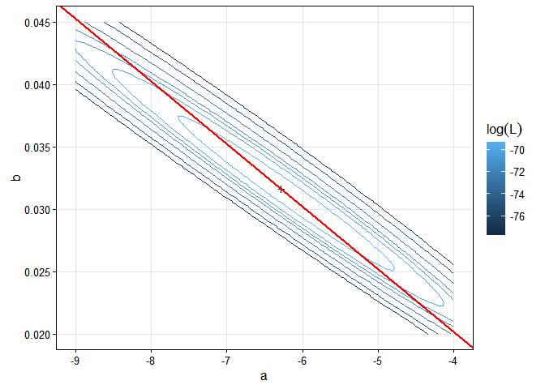
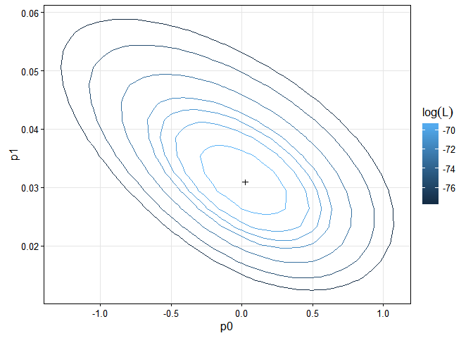
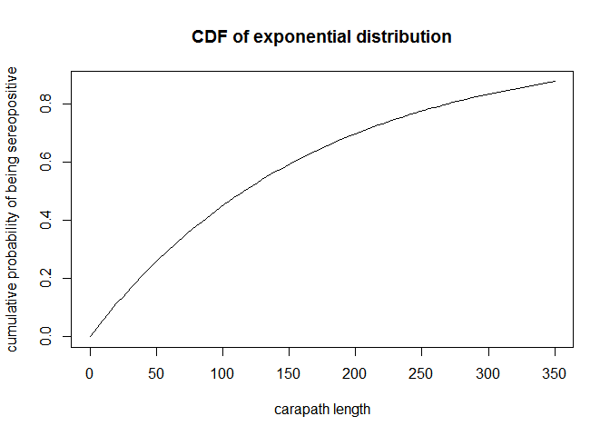
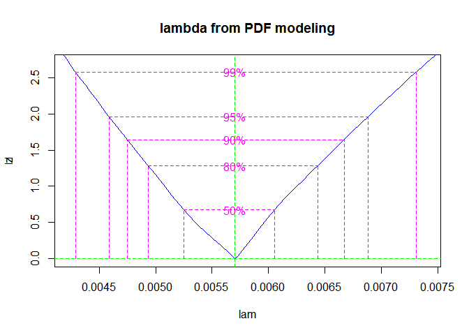

# NRE538_Resampling
Feng-Hsun Chang  
2016.11.22  


\newcommand\expect[1]{\mathbb{E}\left[{#1}\right]}
\newcommand\var[1]{\mathrm{Var}\left[{#1}\right]}
\newcommand\loglik{\ell}
\newcommand\prob[1]{\mathbb{P}\left[{#1}\right]}
\newcommand{\dd}[1]{\mathrm{d}{#1}}

* What does the shape of the likelihood surface tell us about the identifiability of the parameters? What does it say about which aspects of the data are most informative?

The following is the likelihood contour of the original model with the `logit` function describing the hazard function and the `logit` function depends linearly on the carapath length ($L_i$), i.e. $\mathrm{logit}(p_i) = a + b\,L_i,$. 

This shape indicates that on a certain axis of parameter "a" and "b" combination, the likelihood of observing this given data are similar. Along this combination axis, the data are not informative to tell if the model is good enough to describe (or explain?) the data. 

Here I make the infection hazard a function of carapace length. I first try the hazard function in the Michaelis-Menten form. 

$$\lambda(L) = \frac{r_mL}{K+L}$$,  
where $r_m$ is the highest probability an individual could be infected, and $K$ describes the carapace length where the individual has half of the $r_m$. 

Accordingly, the CDF the determines the probability of an individual to be seropositive is 

$$\prob{X_i=\text{pos}} = 1 - \exp{\left[-\int_0^L\!\lambda(L)\dd{L}\right]} = 1 - \exp{\left [-r_m\,K (\frac{L}{K} - Log(1 + \frac{L}{K}) \right ]}$$.

---
title: "Assignment 8-1 Maximum Likelihood Lab"
author: "Feng-Hsun Chang"
date: "2016 Nov. 15"
output: 
  html_document:
    code_folding: show
    highlight: haddock
    number_sections: False
    theme: yeti
    toc: true
    toc_float:
      collapsed: false
      smooth_scroll: true
---

\newcommand\loglik{\ell}
\newcommand\prob[1]{\mathbb{P}\left[{#1}\right]}
\newcommand{\dd}[1]{\mathrm{d}{#1}}


# Exercise 1

* What does the shape of the likelihood surface tell us about the identifiability of the parameters? What does it say about which aspects of the data are most informative?

The following is the likelihood contour of the original model with the `logit` function describing the hazard function and the `logit` function depends linearly on the carapath length ($L_i$), i.e. $\mathrm{logit}(p_i) = a + b\,L_i,$. The red line indicates the carapace length at which the probability of seropositive is 50% given the estimated parameter "a" and "b". 


```r
gt = read.csv("http://kinglab.eeb.lsa.umich.edu/480/data/gophertortoise.csv",
              comment.char="#",colClasses=c(date="Date",sex="factor",elisa="factor")) %>%
     arrange(carapace.length,date)
gt1 = gt %>% 
  ddply(~id,subset,date==min(date)) %>% 
  mutate(serostatus=ifelse(elisa=="neg",0,1))

loglik = function (p, serostatus) {
  sum(log(dbinom(x=serostatus,size=1,prob=p)))
}

nll = function (a, b, carapace.length, serostatus) {
  -loglik(p=plogis(a+b*carapace.length),serostatus)
}

fit = mle2(nll,start=list(a=0,b=0),data=gt1)

params = 
  expand.grid(
  a=seq(-9,-4,length=100),
  b=seq(0.02,0.045,length=100)) %>%
  ddply(~a+b,mutate,
        loglik=-nll(a,b,gt1$carapace.length,gt1$serostatus)
  )  

breaks <- logLik(fit)-qchisq(p=c(0.5,0.8,0.9,0.95,0.99,0.999,0.9999),df=2)/2

ggplot(data=params, aes(x=a,y=b,z=loglik))+
  stat_contour(aes(color=..level..),breaks=breaks)+
  geom_point(x=coef(fit)["a"],y=coef(fit)["b"],shape=3)+
  labs(color=expression(log(L)))+
  geom_abline(slope=(coef(fit)["b"]/coef(fit)["a"]), intercept=0, col="red", size=1)+
  theme_bw()+
  theme(#panel.grid.major=element_blank(),
        panel.grid.minor=element_blank(),
        strip.background = element_blank(),
        panel.border=element_rect(color="black"),
        legend.key = element_blank())
```

<!-- -->

This shape indicates that on a certain axis of parameter "a" and "b" combination, the likelihood of observing this given data are fairly similar. Along this combination axis, the data are not informative to tell if the model is good enough to describe (or explain?) the data. 

I now try another model to describe the data with another model that intends to describe how much the probability of seropositive would change when an individual grows larger (or is smaller) than a certain carapace length. This carapace length is the length where the probability of seropositive is 50% given the estimated parameter "a (-6.2817)" and "b (0.0316)" in the previous model. So the odds ration function becomes the following. 

$$\mathrm{logit}(p_i) = p_0 + p_1(L_i-198.844)$$, 

where $p_0$ is the probability of seropositive when the carapace length is at 198.844, and $p_1$ is the change of seropositive probability when the individual grows larger (or is smaller) then 198.844. 


```r
L50 = -(coef(fit)["a"]/coef(fit)["b"])

loglik = function (p, serostatus) {
  sum(log(dbinom(x=serostatus,size=1,prob=p)))
}

nll.1 = function (p0, p1, carapace.length, serostatus) {
  -loglik(p=plogis(p0+p1*(carapace.length-L50)), serostatus)
}

fit.1 = mle2(nll.1, start=list(p0=0,p1=0),data=gt1)

params.1 = 
  expand.grid(
  p0=seq(coef(fit.1)["p0"]-1.5, coef(fit.1)["p0"]+1.5, length=100),
  p1=seq(coef(fit.1)["p1"]-0.15, coef(fit.1)["p1"]+0.15, length=100)) %>%
  ddply(~p0+p1, mutate,
        loglik=-nll.1(p0, p1, gt1$carapace.length, gt1$serostatus)
  )  

breaks.1 = logLik(fit.1)-qchisq(p=c(0.5,0.8,0.9,0.95,0.99,0.999,0.9999),df=2)/2

ggplot(data=params.1, aes(x=p0, y=p1, z=loglik))+
  geom_contour(aes(color=..level..), breaks=breaks.1)+
  geom_point(x=coef(fit.1)["p0"], y=coef(fit.1)["p1"], shape=3)+
  labs(color=expression(log(L)))+
  theme_bw()+
  theme(#panel.grid.major=element_blank(),
        panel.grid.minor=element_blank(),
        strip.background = element_blank(),
        panel.border=element_rect(color="black"),
        legend.key = element_blank())
```

<!-- -->

We see that the likelihood surface is different from the previous one. In this model, the two parameters looks more informative than the previous two ("a" and "b") as the surface becomes more rounded. This indicates that the changes in either p0 and p1 parameters would lead to large decrease in likelihood. This model is also easier to interpret. The "p0" parameter means the probability of seropositive when the carapace is at 198.844. The "p1" parameter means the rate of increase when an individual grow larger than 198.844 in exponential scale. For example, with 1 mm increase in carapace length, the probability of seropositive would increase 1.031%. 

# Exercise 2

* Use `mle2` to fit the survival curve, assuming a constant force of infection and that $L \propto a$. Estimate the force of infection. What are its units? Use confidence intervals (CI) to quantify the uncertainty in your estimate. Make a plot that overlays the model predictions on the data. Plot the likelihood curve. Indicate the MLE and CI for different levels on your plot.

Here I'm using the following exponential function to model the increase of seropositive probability with carapace length. 


```r
curve(1-exp(-(x*0.006)),from=0,to=350, 
      xlab="carapath length",
      ylab="cumulative probability of being sereopositive", 
      main="CDF of exponential distribution")
```

<!-- -->


Now I estimate the $\lambda$ parameter that determines, at given carapace length, the probability of seropositive and the maximum likelihood associated with the estimated $\lambda$. 


```r
nll.2 = function (lam, carapace.length, serostatus) { 
  -sum(log(dbinom(x=serostatus, size=1, prob=1-exp(-(carapace.length*lam)))))
}

fit.2 = mle2(nll.2, start=list(lam=0.005),data=gt1)

coef(fit.2)
```

```
##         lam 
## 0.005704184
```

```r
logLik(fit.2)
```

```
## 'log Lik.' -82.61491 (df=1)
```

* Note that I mute the warning here as I know some negative $\lambda$ would produce probabilities that generate NaN when being used to calculate likelihood.

The $\lambda$ is estimated to be 0.0057042 and the associated maximum likelihood is -82.6149113.  
I then calculate the confidence interval of the $\lambda$ parameter. 


```
##       2.5 %      97.5 % 
## 0.004589098 0.006881101
```

<!-- -->

I then overlay the model predictions (blue line) with 95% confidence interval on the data.
